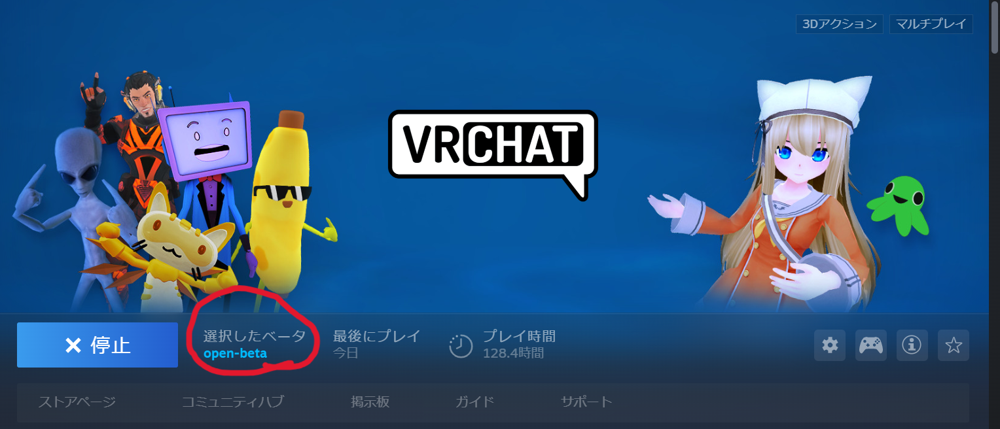
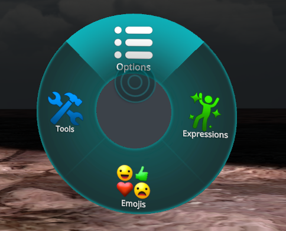
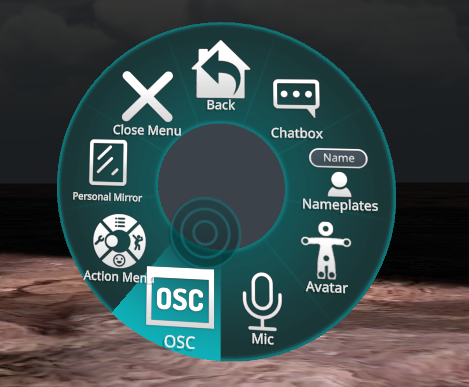
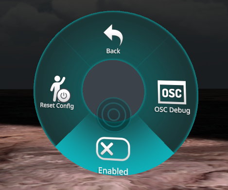

# 概要
クリックなどの操作をVRChat上でアバターのパラメータとして扱うためのソフトです。  
クリック中だけ口からビームを出すみたいなことができるようになります。

# 前提知識
アバターのアニメーションを触ったことがある前提です。

# 使い方
以下の3ステップです。
* OSCの有効化
* アバターからクリック状態を取得できるようにする
* ソフトを起動して実際に使う 
## OSCの有効化
このソフトを利用するためには、VRChat上でOSCを有効化する必要があります。以下の手順に従って、有効化してください。
### VRChatのOpen-Betaに参加する
OSCを有効化するためにはまず、VRChatのOpen-Betaに参加する必要があります。
1. SteamのライブラリからVRChatを右クリックし、プロパティを選択する。
2. ベータをクリックし、ベータへの参加でOpen-Betaを選択します。

これでOpen-Betaへの参加ができました。  
画像のように、選択したベータがopen-betaとなっていればOKです。  

### VRChatでOSCを有効化する
1. VRChatを起動します。
2. Expression Menuを開き、Optionを選択します。  

3. OSCを選択します。  

4. Enabledを選択し、OSCを有効化します。
  
`vrc_osc_controller.exe`を実行します。

これで、OSCの有効化ができました。

## アバターからクリック状態を取得できるようにする
1. アバターのAnimatorとExpression Parametersにbool型のパラメータ`left_click`, `right_click`, `middle_click`を追加します。
2. これらのパラメータは、クリックされている間はtrue, 離している間はfalseになります。それを踏まえて、アバターのアニメーションに組み込みましょう。

## ソフトを起動して実際に使う
以下の手順で起動してください。
### IPアドレスの確認
1. Windowsのスタートメニューを開いてcmdと入力し、コマンドプロンプトを起動する
2. ipconfigと入力しエンターキーを押す
3. 無線を使ってる方は`Wireless LAN Adapter ○○`, 有線を使ってる方は`イーサネットアダプター ○○`と書いているところのIPv4アドレスを確認します。`192.168.x.x`とか`172.16.x.x`とかそんな感じの数字がアドレスです。
### ソフトの起動
1. vrc_osc_controller.exeを実行します。
2. IPアドレスを聞かれるので、さっき確認したアドレスを入力し、エンターキーを押します。
3. 起動が完了します。
4. 閉じるときは普通のアプリを閉じるのと同じ要領でXボタンを押します。

# ライセンス
[LGPL](LICENSE)